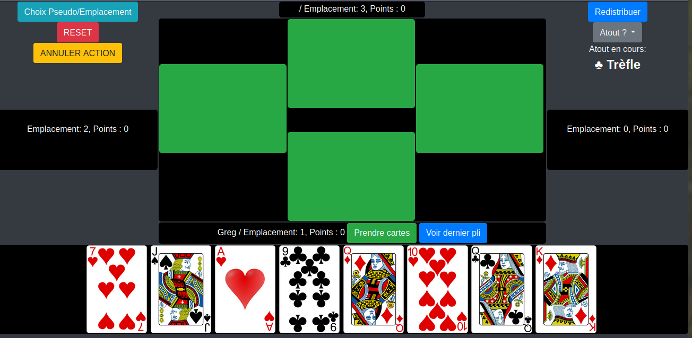

# Coinche

Careful ! Dirty dirty dirty weekend/lockdown code.

Implements partially the french card game "coinche", or "contrée". The goal is not to do everything on the website, you still need to communicate with the other players with a chat/voice program.
The game is not localized.

To run : `npm install express deepcopy socket.io && node app.js`

[Live demo](https://gregoiredelannoy.fr/coinche/)

